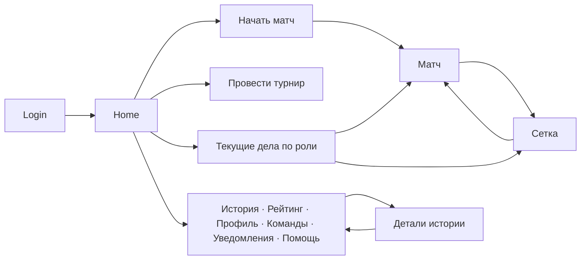
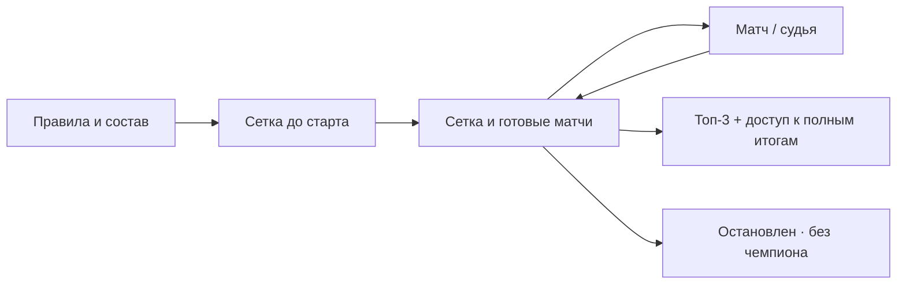

# TECH-008 — согласованная программа интерфейса (2026-09-18)

Состояние: **этап 0 accepted_local**, TECH-008 `in_progress` до реализации и
проверки остальных этапов. [Acceptance receipt](../audits/2026-09-13-ux-ui/implementation/stage0-acceptance.json).
[BACKLOG](../BACKLOG.md) остаётся
единственным источником canonical задач и статусов; этот план задаёт порядок,
зависимости и приёмку. [D36/D37](../DECISIONS.md) и обновлённые PRD/AT — целевой
слой. [AS_BUILT](../architecture/AS_BUILT.md) и текущий runtime по-прежнему
описывают прежние пять tabs и доступные приглашения. Экспертный пакет и два
сеанса — evidence, а не альтернативные требования. Реестр:
[coverage.csv](../audits/2026-09-13-ux-ui/implementation/coverage.csv),
[схема потоков](../audits/2026-09-13-ux-ui/implementation/stage0-flow-report.html),
[смысловая сверка первичных сообщений](../audits/2026-09-13-ux-ui/implementation/semantic-review.md).

## Инварианты и границы evidence

- Главная — единственный глобальный вход, без bottom tabs и общего меню; внутри
  Back/Home и контекстный возврат. Onboarding адаптируется в том же изменении.
- Оператор может создать/судить матч A против B, не играя. Один active judge,
  auth session, idempotency/version, busy/distinct и статистика не ослабляются.
- Game/tournament invites и challenges скрываются во всём UI по D37; API, rows,
  audit и D35 сохраняются. Team invites, judge handover/reservations остаются.
- D24/D33 сохраняют immutable result, компенсацию и downstream турнирной истории.
  Предложения о replay или 10-секундном Undo не меняют эти правила без решения.
- Из 39+43 уникальных эпизодов один автор продукта описал состояния на физическом
  iPhone; нет непрерывной записи касаний, API/DB evidence или измерения успеха.
  U01 с неиграющим оператором, U03 и подготовка следующей пары U05 не проверены.
  19+25 image hashes учтены; оригиналы остаются во внешнем ephemeral источнике.
  [Visual receipt](../audits/2026-09-13-ux-ui/implementation/sources/primary-visual-receipt.json)
  фиксирует просмотр 44 кадров Luna и две spot checks координатора; касаний,
  API/DB и persistent zoom он не доказывает. Третье
  место с 27 очками при 21/11 у первых двух не доказывает ошибку ранжирования.
- Экспертные 38 target ID были приняты до D36/D37. Их старые формулировки
  проверяются через [новый overlay](../BACKLOG.md), не передаются unchanged.
- Статусные чипы и иконки требуют общей семантики по UI-001/GAP-034. Stage 2
  Home использует текущие компоненты; stage 3 принимает межэкранный inventory и
  target до визуального уточнения Home и остальных consumers, без rebrand.

## Карта текущих routes и целевых выходов

Ниже инвентарь `apps/web/src/App.tsx` на исходном SHA. «Цель» означает будущую
проверку, не утверждение о реализованном поведении. Для всех protected routes:
startup loading/error, 401/reauth, forced password, incomplete onboarding,
blocked/403, not found/404, reload и чужой аккаунт проверяются отдельно.

| Текущий route | Роль/состояние | Цель и контекст возврата |
|---|---|---|
| `/login`, `/first-password` | guest, временный пароль, 401 | безопасный scoped return; чужой аккаунт очищает старый контекст |
| `/` | active user | единственный global entry; CTA и задачи по player/judge/organizer, role-gated admin |
| `/start` | active user; старый deep link | совместимый путь к прямому выбору без пустого обязательного hub |
| `/matches/new`, `/matches` | active creator / directory | ручной A-vs-B, discovery списка; invite/challenge prefill не открывается |
| `/matches/:id` | видимый участник/judge/organizer, terminal readonly | источник Home/history/bracket сохраняется; forbidden не раскрывает детали |
| `/matches/:id/judge` | current active judge / spectator readonly / tutorial | immersive, безопасный exit с server-confirmed release; body/safe-area restore |
| `/tournaments`, `/tournaments/:id` | organizer, participant, judge, active admin scoped | правила → состав → сетка → текущая пара → результат; возврат в ту же сетку |
| `/history` | active user | фильтры, страницы и scroll переживают detail/back и reload по принятому контракту |
| `/rankings` | active user | доступен с Home; blocked исключены по действующим правилам |
| `/teams`, `/teams/:id` | member/captain/invitee | entry с Home/profile; team invitation и captain rights сохранены |
| `/profile`, `/players/:userId` | owner / authorized public viewer | вторичные stats, sessions, help, teams; privacy и challenge hiding |
| `/notifications` | owner | видимые team/handover и другие разрешённые записи; count/list/popup согласованы |
| `/help`, `/onboarding` | active user / incomplete onboarding | помощь и обучение доступны, anchors не указывают на удалённые tabs |
| `/admin` | active admin | только существующие права; exact-ID read зависит от Q-UX-003 |
| `*` | all | 404 с безопасным Home; 403 — отдельное закрытое состояние |

Контекстный Back не обязан совпадать с браузерным history при прямом входе:
fallback должен быть назван и не раскрывать недоступное событие. Home не
заменяет осознанный выход из judge; неизвестный ответ release остаётся явно
неопределённым до authoritative GET. Scroll/focus, keyboard и safe-area на
мобильном проверяются в соответствующем этапе.

## Обзорные схемы целевого пути





## Этапы и bounded work orders

Каждый этап начинается с проверки свежего `main`, долга и decision gates;
проводится одним writer для общих файлов. Параллельные независимые child works —
не более трёх по ORCHESTRATION; root принимает frozen delta после Terra review.
Номер версии определяется по фактическому пакету перед разрешённым выпуском.

| Этап | Наблюдаемый результат / canonical link | Обязательная проверка и gate |
|---|---|---|
| 0 | TECH-008: D36/D37, REQ/AT, coverage 82/38, route/state карта — accepted_local | docs checker, links, semantic atom review, independent Terra PASS, rollback; без runtime и версии |
| 1 | GAP-029: скрыть game/tournament invitations и challenges во всех UI seams | AT-UI-INV-001/002; старые links/query, `unreadCount` и первые пять, team/handover не регрессируют |
| 2 | GAP-030/031 + GAP-015: Home-only shell и роль/задача на Home | AT-HOME-001..003, auth/404/403, bracket/history return, onboarding anchors в том же delta |
| 3 | BUG-018..028 по применимости, BUG-040, GAP-034: controls и межэкранный status/icon inventory/target | keyboard/focus/visible option над клавиатурой и safe area; UI-001/AT-UI-STATUS-001 по всем семействам; physical zoom отдельно |
| 4 | BUG-029/031/039: recovery счёта и ручной коррекции | authoritative GET exact key/version, intent queue, PG concurrency; unresolved не предлагает повтор |
| 5 | GAP-013 и MATCH setup: состав перед редкими правилами | оператор не игрок; search/presets/serve; Q-UX-004/005/006 до зависимых механик |
| 6 | GAP-017/023, GAP-032: judge/result/next; GAP-034 match/judge consumer | stable touch geometry, status/serve icon meaning, reduced motion, safe exit, D24/D33; Q-UX-007/008/009 перед replay/Undo/историей ведущих |
| 7 | GAP-019 scope A + GAP-021: collecting/needs_regeneration, authoritative rules/roster до сетки | D35/D37, direct add, prestart edit/regeneration; reusable guest/future date — Q-UX-004/010 |
| 8 | GAP-019 scope B + GAP-020/033, BUG-032/033: generated/active/terminal composition, сетка, lifecycle, итоги; GAP-034 tournament consumer | после принятого scope A; SE/DE/BYE/third place, bracket/current match first, full results secondary, stopped without champion |
| 9 | GAP-022, BUG-034/035, GAP-025 gate: команды; GAP-034 team consumer | captain/team invitation rights и ясный status; avatar только после Q-UX-002 |
| 10 | GAP-024, BUG-036/037: история, профиль, уведомления; GAP-034 history/notifications consumers | back/filter/scroll; read state, status и видимые counts; privacy |
| 11 | GAP-026/027, GAP-028 gate: admin; GAP-034 admin consumer | active-admin access, session revocation, status/action distinction; exact-ID read после Q-UX-003 |
| 12 | BUG-038: password-reset uncertainty отдельно | контракт + migration + PostgreSQL + browser; не смешивать с UI polish |
| 13 | GAP-014/016, GAP-009: onboarding/help | новые anchors, tutorial isolation, explicit completion, контекстная помощь |
| 14 | TECH-008 integration: полная карта и выпуск | `pnpm run verify:all` по риску, exact version/SHA, read-only public smoke, physical-iPhone gate отдельно |

`verified_local` — canonical backlog status после local evidence. В плане
`published_for_test` означает согласованные version/SHA на disposable stand, а
`accepted` — приёмку пользователем после отдельной проверки телефона. Это
milestones программы, **не** новые backlog statuses. Эмуляция и скриншот не
подтверждают physical iPhone zoom; ожидающий phone gate остаётся открытым.

GAP-019 — **одна** canonical задача и общий `TournamentDetailPage.tsx` с одним
writer одновременно: scope A этапа 7 принимается отдельно, затем scope B этапа
8 работает поверх него. Registry T01/T02 → 7, T03/T04 → 8; экспертный main row
помечает начало задачи в 7 и не означает, что generated/active часть готова.
GAP-020, BUG-032/033 не редактируют общий экран параллельно с GAP-019. Полная
задача остаётся незавершённой, пока оба subscopes не пройдут собственные AT.

GAP-034 в этапе 3 фиксирует inventory, семантический и визуальный target всех
status/icon семейств и Home/common-control sample; он не объявляет все экраны
реализованными. Match/judge применяет контракт в 6, tournament в 8, team в 9,
history/notifications в 10, admin в 11. Один writer владеет общим компонентом
во время каждого consumer delta; каждый экран проверяет права, meaningful states,
текст/иконки/focus и свою AT-UI-STATUS-001 часть. Следующий work order сверяет
свежий inventory и status уже выполненных consumers.

## Открытые зависимости

[OPEN_QUESTIONS](../OPEN_QUESTIONS.md) содержит Q-UX-001/002/003 и новые
gates: reusable guest identity/history, remembered custom score, единый
create/acquire/start, replay, ten-second Undo/archive, представление истории ведущих,
future scheduling. Эти идеи имеют stage и decision gate в реестре; до решения
соответствующие subwork не исполняются даже внутри `ready` GAP-013/017/019.
Модель приглашений D37 решена только как временный UI
overlay; восстановление доступности — Q-UX-011.

## Шаблон каждого work order и release acceptance

```text
WORK ORDER: canonical AREA-NNN / один наблюдаемый результат
BASELINE: HEAD, origin/main, исходные bytes, dirty/untracked scope
SOURCES: ADR + PRD/AT + evidence episode/atom + as-built
WRITE SCOPE: exact paths, один writer и запрещённые соседние пути
DEPENDENCIES: принятые контракты и открытые decision gates
ACCEPTANCE: Given/When/Then, роли, negative/stale/loading/empty/error,
            deep-link, keyboard, 390px/desktop и physical device если требуется
VERIFY: Red, focused, PG/browser/full по риску; response + persisted state
RELEASE: SemVer level, exact SHA web/API/proxy, read-only public smoke,
         physical phone acceptance отдельно
RETURN: changed paths, commands/results/skips, frozen delta, rollback, risks
```

После каждого этапа сверить актуальность GAP-011/TECH-002 и технического долга;
предложить ограниченный debt sprint после release, не создавать фиктивную
задачу ради маршрутизации. Программа не разрешает публичный reset/seed,
down-migration, секреты, DNS или другие изменения инфраструктуры.
